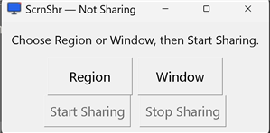
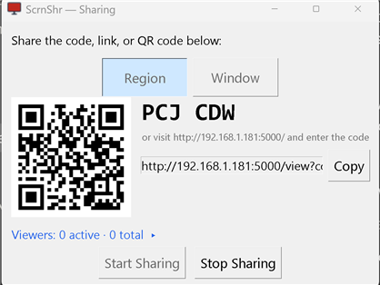

# ScrnShr

Screen sharing over plain HTTP/MJPEG. Share a selected region or a specific
window; anyone on your LAN can watch it live in a plain web browser, no
client install needed.

## Screenshots

| Idle | Sharing |
| --- | --- |
|  |  |

## Features

- Share a custom region, or a specific window (even if it gets covered by
  other windows)
- Viewers just open a link, scan a QR code, or type a short code on a landing
  page — no app to install
- Live viewer list: see who's connected (IP, OS/browser, best-effort hostname)
  and how many have ever joined this session
- View-only (no remote control)
- Windows-first (uses Windows-only APIs for the overlay and window capture)

## Requirements

- Python 3.10+
- Windows 10 (version 1607 / Anniversary Update or later) or Windows 11 —
  that's the actual floor set by the Windows APIs this uses (per-monitor DPI
  awareness, window enumeration, `PrintWindow`). Tested on Windows 11; should
  work on Windows 10 but hasn't been verified there.

## Run it

Double-click **[run.bat](run.bat)**. First run creates a virtual environment
and installs dependencies (you'll briefly see a console window for that); the
app itself then opens with no console window.

If you'd rather see console/debug output (Flask request logs, the direct link,
any tracebacks), run it directly instead:

```bash
venv\Scripts\python.exe scrnshr.py
```

## Usage

1. The control panel opens first. Choose **Region** or **Window**:
   - **Region**: a red-bordered rectangle appears — drag its border to move
     it, or drag a corner handle to resize it. The interior is see-through
     and click-through, so you can still use your desktop underneath.
   - **Window**: pick a window from the list (hover a truncated name to see
     it in full; **Refresh** re-scans open windows).
2. Click **Start Sharing**. The title bar and app icon switch to a pulsing
   "Sharing" state, and three ways to share appear:
   - A **QR code** — scan it to jump straight into the stream
   - A short **code** (e.g. `QXT 9ST`) to read aloud or text — the recipient
     visits the plain landing page and types it in
   - A **direct link** with a **Copy** button, for pasting into a chat
3. Under that, **Viewers: N active · N total** shows who's connected — click
   it to expand a list with each viewer's IP, OS/browser, best-effort
   hostname, and how long they've been connected (or when they left). The
   total is cumulative for the session, so it still reflects someone who
   connected briefly and left — handy for noticing if more people accessed
   the share than you expected.
4. Click **Stop Sharing** to end it (or just close the control panel).

You can switch between **Region** and **Window** at any time, including while
already sharing — click the other mode (and pick a window, if switching to
Window) and the live stream retargets immediately. Viewers never notice: no
reconnect, no new link, no new code. If the window you're sharing gets closed,
the stream just pauses on its last frame with a status note — pick a new
window or switch to Region to pick back up, no need to stop and restart.

## Security notes

- Access is gated by a random 6-character code generated at startup (shown as
  text, embedded in the QR code and direct link) — this is basic
  access-gating, not real authentication.
- Guessing the code is rate-limited: 5 wrong attempts from an IP locks it out
  for a minute, whether via the landing page or a direct link/stream request.
- The server binds to all interfaces (`0.0.0.0`) so it's reachable on your LAN.
  Don't port-forward it to the internet without understanding the risk.
- A new code is generated every run.
- The viewer list is visible only to you, in your own control panel.

## Known limitations (v1)

- View-only — viewers cannot control your mouse/keyboard
- One source live at a time (no side-by-side multi-region/multi-window layouts)
- Windows-only (overlay transparency and window capture both use Windows APIs)
- Minimized windows, and some GPU/DirectX-rendered windows, may capture blank
  or black — `PrintWindow` can't always see into those
- Viewer hostnames are best-effort (reverse DNS) and often unavailable,
  especially for phones — IP + OS/browser is always shown regardless
- Uses Flask's built-in dev server, fine for a handful of LAN viewers but not
  meant for many concurrent connections

## Troubleshooting

- **A message box says the port is already in use**: another ScrnShr
  instance is probably still running — close it first (check Task Manager for
  a `pythonw.exe` process if you don't see a window).
- **Windows Firewall prompt on first run**: allow access on Private networks.
- **Feed looks offset from what you selected (region mode)**: this usually
  means display scaling changed after the app started — restart it after
  changing display scaling.
- **A sliver of red border shows up in the stream (region mode)**: the border
  is inset out of the captured region by a few pixels (see `BORDER` in
  `scrnshr.py`); if you change the border width, the capture inset must
  match.
- **"Too many attempts" when entering the code**: the rate limiter locks an IP
  out for a minute after 5 wrong guesses — wait, or double-check the code.

## Future ideas

- Multi-region / multi-monitor picker
- Lower-latency delivery (WebRTC)
- Package as a standalone `.exe`

## License

[MIT](LICENSE) — free to use, modify, and distribute.
